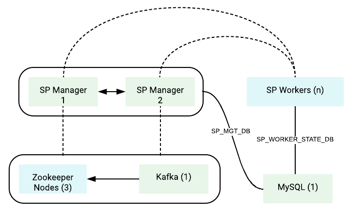

# Kubernetes resources for a Fully Distributed Deployment of WSO2 Stream Processor

Core Kubernetes resources for a [fully distributed deployment of WSO2 Stream Processor](https://docs.wso2.com/display/SP420/Fully+Distributed+Deployment).<br>

<br>

## Contents

* [Prerequisites](#prerequisites)
* [Quick Start Guide](#quick-start-guide)

## Prerequisites

* In order to use WSO2 Kubernetes resources, you need an active WSO2 subscription. If you do not possess an active
WSO2 subscription already, you can sign up for a WSO2 Free Trial Subscription from [here](https://wso2.com/free-trial-subscription).<br><br>

* Install [Git](https://git-scm.com/book/en/v2/Getting-Started-Installing-Git) and [Kubernetes client](https://kubernetes.io/docs/tasks/tools/install-kubectl/) (compatible with v1.10)
in order to run the steps provided in the following quick start guide.<br><br>

* An already setup [Kubernetes cluster](https://kubernetes.io/docs/setup/pick-right-solution/).<br><br>

* A pre-configured Network File System (NFS) to be used as the persistent volume for artifact sharing and persistence.
In the NFS server instance, create a Linux system user account named `wso2carbon` with user id `802` and a system group named `wso2` with group id `802`.
Add the `wso2carbon` user to the group `wso2`.

```
groupadd --system -g 802 wso2
useradd --system -g 802 -u 802 wso2carbon
```

## Quick Start Guide

>In the context of this document, `KUBERNETES_HOME` will refer to a local copy of the [`wso2/kubernetes-sp`](https://github.com/wso2/kubernetes-sp/)
Git repository.<br>

##### 1. Clone Kubernetes Resources for WSO2 Stream Processor Git repository.

```
git clone https://github.com/wso2/kubernetes-sp.git
```
##### 2. Create a namespace named `wso2` and a service account named `wso2svc-account`, within the namespace `wso2`.

```
kubectl create namespace wso2
kubectl create serviceaccount wso2svc-account -n wso2
```

Then, switch the context to new `wso2` namespace.

```
kubectl config set-context $(kubectl config current-context) --namespace=wso2
```

##### 3. Create a Kubernetes Secret for pulling the required Docker images from [`WSO2 Docker Registry`](https://docker.wso2.com).

Create a Kubernetes Secret named `wso2creds` in the cluster to authenticate with the WSO2 Docker Registry, to pull the required images.

```
kubectl create secret docker-registry wso2creds --docker-server=docker.wso2.com --docker-username=<WSO2_USERNAME> --docker-password=<WSO2_PASSWORD> --docker-email=<WSO2_USERNAME>
```

`WSO2_USERNAME`: Your WSO2 username<br>
`WSO2_PASSWORD`: Your WSO2 password

Please see [Kubernetes official documentation](https://kubernetes.io/docs/tasks/configure-pod-container/pull-image-private-registry/#create-a-secret-in-the-cluster-that-holds-your-authorization-token)
for further details.

##### 4. Setup product database(s).

Setup the external product databases. Please refer WSO2's [official documentation](https://docs.wso2.com/display/SP420/Fully+Distributed+Deployment) on creating the required databases for the deployment.
                                       
Provide appropriate connection URLs, corresponding to the created external databases and the relevant driver class names for the data sources defined in
the following files under `wso2.datasources` configurations:
  
  * `<KUBERNETES_HOME>/pattern-distributed/confs/sp-manager/conf/deployment.yaml`
  * `<KUBERNETES_HOME>/pattern-distributed/confs/sp-worker/conf/deployment.yaml`
                                      
**Note**:

For **evaluation purposes**,

* You can use Kubernetes resources provided in the directory `<KUBERNETES_HOME>/pattern-distributed/extras/rdbms/mysql`
for deploying the product databases, using MySQL in Kubernetes. However, this approach of product database deployment is
**not recommended** for a production setup.

* For using these Kubernetes resources,

    first create a Kubernetes ConfigMap for passing database script(s) to the deployment.
    
    ```
    kubectl create configmap mysql-dbscripts --from-file=<KUBERNETES_HOME>/pattern-distributed/extras/confs/mysql/dbscripts/
    ```
    
    Here, a Network File System (NFS) is needed to be used for persisting MySQL DB data.
    
    Create and export a directory within the NFS server instance.
    
    Provide read-write-execute permissions to other users for the created folder.
    
    Update the Kubernetes Persistent Volume resource with the corresponding NFS server IP (`NFS_SERVER_IP`) and exported,
    NFS server directory path (`NFS_LOCATION_PATH`) in `<KUBERNETES_HOME>/pattern-distributed/extras/rdbms/volumes/persistent-volumes.yaml`.
    
    Deploy the persistent volume resource and volume claim as follows:
       
     ```
      kubectl create -f <KUBERNETES_HOME>/pattern-distributed/extras/rdbms/mysql/mysql-persistent-volume-claim.yaml
      kubectl create -f <KUBERNETES_HOME>/pattern-distributed/extras/rdbms/volumes/persistent-volumes.yaml
     ```
     
    Then, create a Kubernetes service (accessible only within the Kubernetes cluster) and followed by the MySQL Kubernetes deployment, as follows:
       
     ```
      kubectl create -f <KUBERNETES_HOME>/pattern-distributed/extras/rdbms/mysql/mysql-service.yaml
      kubectl create -f <KUBERNETES_HOME>/pattern-distributed/extras/rdbms/mysql/mysql-deployment.yaml  
     ```
     
##### 5. Create a Kubernetes role and a role binding necessary for the Kubernetes API requests made from Kubernetes membership scheme.

```
kubectl create --username=admin --password=<cluster-admin-password> -f <KUBERNETES_HOME>/rbac/rbac.yaml
```

`K8S_CLUSTER_ADMIN_PASSWORD`: Kubernetes cluster admin password

##### 6. Setup a Network File System (NFS) to be used for persistent storage.

Create and export unique directories within the NFS server instance for each Kubernetes Persistent Volume resource defined in the
`<KUBERNETES_HOME>/pattern-distributed/volumes/persistent-volumes.yaml` file.

Update the NFS server IP (`NFS_SERVER_IP`) and export path (`NFS_LOCATION_PATH`) of the following persistent volume resources
defined in the `<KUBERNETES_HOME>/pattern-distributed/volumes/persistent-volumes.yaml` file.

Grant ownership to `wso2carbon` user and `wso2` group, for each of the previously created directories.

```
sudo chown -R wso2carbon:wso2 <directory_name>
```

Grant read-write-execute permissions to the `wso2carbon` user, for each of the previously created directories.

```
chmod -R 700 <directory_name>
```

Update each Kubernetes Persistent Volume resource with the corresponding NFS server IP (`NFS_SERVER_IP`) and exported, NFS server directory path (`NFS_LOCATION_PATH`).

Then, deploy the persistent volume resource and volume claim as follows:

```
kubectl create -f <KUBERNETES_HOME>/pattern-distributed/sp/wso2sp-mgt-volume-claim.yaml
kubectl create -f <KUBERNETES_HOME>/pattern-distributed/volumes/persistent-volumes.yaml
```

##### 7. Create Kubernetes ConfigMaps for passing WSO2 product configurations into the Kubernetes cluster.

```
kubectl create configmap sp-manager-conf --from-file=<KUBERNETES_HOME>/pattern-distributed/confs/sp-manager/conf/
kubectl create configmap sp-worker-conf --from-file=<KUBERNETES_HOME>/pattern-distributed/confs/sp-worker/conf/
kubectl create configmap sp-dashboard-conf --from-file=<KUBERNETES_HOME>/pattern-distributed/confs/status-dashboard/conf/
```    

##### 8. Create Kubernetes Services and Deployments for WSO2 Stream Processor Manager and Resource nodes.

```
kubectl create -f <KUBERNETES_HOME>/pattern-distributed/sp/wso2sp-manager-1-service.yaml
kubectl create -f <KUBERNETES_HOME>/pattern-distributed/sp/wso2sp-manager-2-service.yaml
kubectl create -f <KUBERNETES_HOME>/pattern-distributed/sp/wso2sp-dashboard-service.yaml
kubectl create -f <KUBERNETES_HOME>/pattern-distributed/sp/wso2sp-manager-1-deployment.yaml
kubectl create -f <KUBERNETES_HOME>/pattern-distributed/sp/wso2sp-manager-2-deployment.yaml
kubectl create -f <KUBERNETES_HOME>/pattern-distributed/sp/wso2sp-dashboard-deployment.yaml

kubectl create -f <KUBERNETES_HOME>/pattern-distributed/sp/wso2sp-worker-service.yaml
kubectl create -f <KUBERNETES_HOME>/pattern-distributed/sp/wso2sp-worker-deployment.yaml
```

##### 9. Deploy Kubernetes Ingress resource.

The WSO2 Stream Processor Kubernetes Ingress resource uses the NGINX Ingress Controller.

In order to enable the NGINX Ingress controller in the desired cloud or on-premise environment,
please refer the official documentation, [NGINX Ingress Controller Installation Guide](https://kubernetes.github.io/ingress-nginx/deploy/).

Finally, deploy the WSO2 Stream Processor Kubernetes Ingress resources as follows:

```
kubectl create -f <KUBERNETES_HOME>/pattern-distributed/ingresses/wso2-dashboard-ingress.yaml
kubectl create -f <KUBERNETES_HOME>/pattern-distributed/ingresses/wso2sp-manager-1-ingress.yaml
kubectl create -f <KUBERNETES_HOME>/pattern-distributed/ingresses/wso2sp-manager-2-ingress.yaml
```
##### 10. Access Management Consoles.

a. Obtain the external IP (`EXTERNAL-IP`) of the Ingress resources by listing down the Kubernetes Ingresses.

```
`kubectl get ing`
```

e.g.

```
NAME                                             HOSTS                     ADDRESS        PORTS     AGE
wso2sp-dashboard-ingress                         wso2sp-dashboard          <EXTERNAL-IP>  80, 443   2m
wso2sp-manager-1-ingress                         wso2sp-manager-1          <EXTERNAL-IP>  80, 443   2m
wso2sp-manager-2-ingress                         wso2sp-manager-2          <EXTERNAL-IP>  80, 443   2m
```

b. Add the above host as an entry in /etc/hosts file as follows:

```
<EXTERNAL-IP>	wso2sp-dashboard
<EXTERNAL-IP>	wso2sp-manager-1
<EXTERNAL-IP>	wso2sp-manager-2
```

##### 11. Siddhi applications should be deployed to the manager cluster using one of the following methods.

a. Dropping the .siddhi file in to the `/data/pattern-distributed/siddhi-files` in the NFS node directory before or after starting the manager node.

b. Sending a "POST" request to `http://<host>:<port>/siddhi-apps`, with the Siddhi App attached as a file in the request as shown in the example below.
Refer [Stream Processor REST API Guide](https://docs.wso2.com/display/SP420/Stream+Processor+REST+API+Guide) for more information on using WSO2 Strean Processor APIs.

```
curl -X POST "https://wso2sp-manager-1/siddhi-apps" -H "accept: application/json" -H "Content-Type: text/plain" -d @TestSiddhiApp.siddhi -u admin:admin -k
```

Default deployment will expose two publicly accessible hosts, namely: <br>

* `wso2sp-manager-1` - To expose Manager Node 1 <br>
* `wso2sp-manager-2` - To expose Manager Node 2 <br>

##### 12. Access Status Dashboard.

Try navigating to `https://wso2sp-dashboard/monitoring` from your favorite browser.
